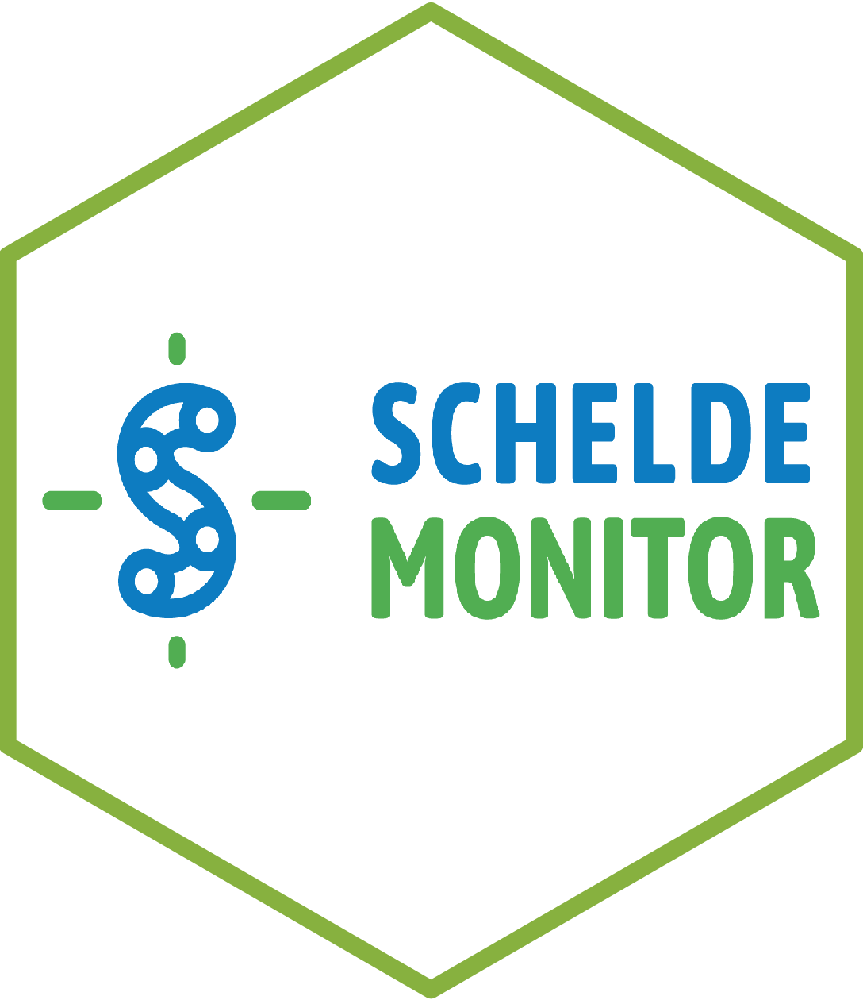

<!-- README.md is generated from README.Rmd. Please edit that file -->

```{r, include = FALSE}
knitr::opts_chunk$set(
  collapse = TRUE,
  comment = "#>",
  fig.path = "man/figures/README-",
  out.width = "100%"
)
```
# scheldemonitoR 

<!-- badges: start -->
[](https://CRAN.R-project.org/package=etn)
[](https://www.repostatus.org/#active)
<!-- badges: end -->

`scheldemonitoR` provides functionality to access data from the [ScheldeMonitor](https://www.scheldemonitor.org/nl) database
hosted by the Flanders Marine Institute (VLIZ). 

## Installation

You can install the development version of scheldemonitoR from [GitHub](https://github.com/) with:

``` r
# install.packages("devtools")
devtools::install_github("scheldemonitor/scheldemonitoR")
```

